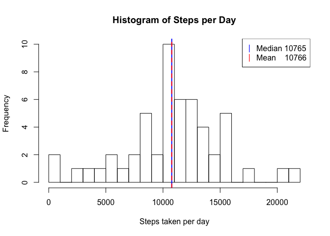
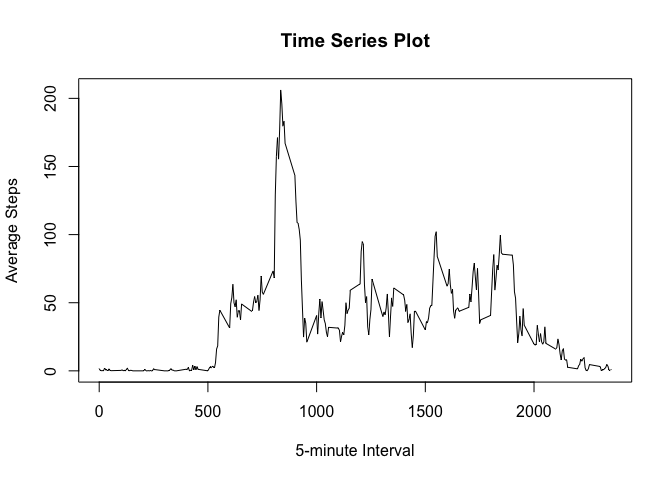
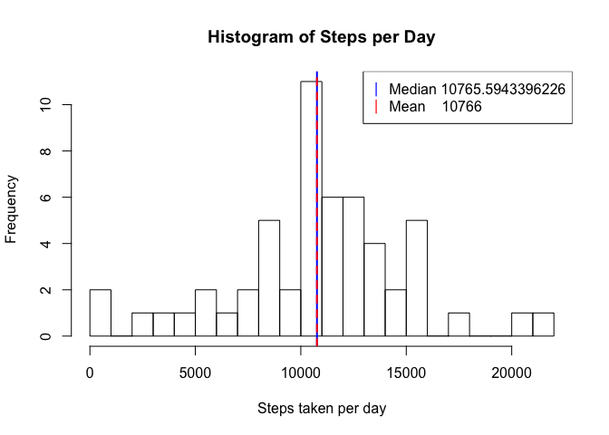
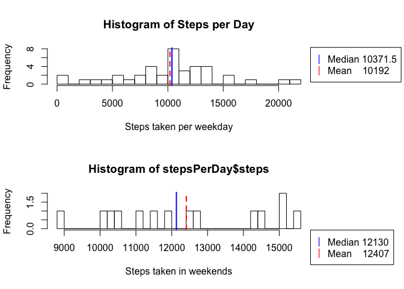
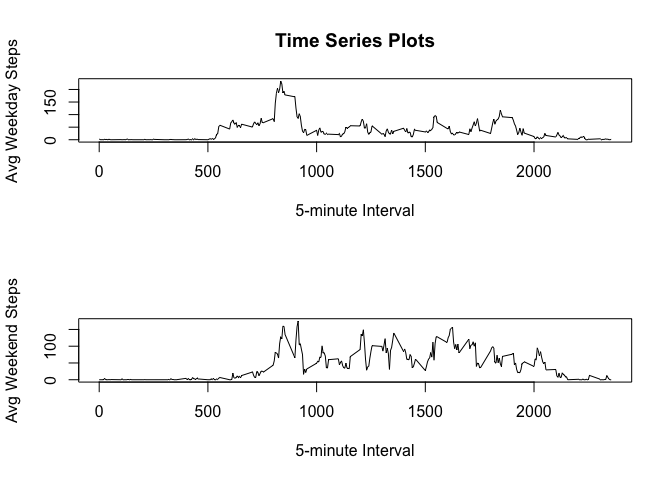

```r
library(chron)
library(dplyr)
```

```
## 
## Attaching package: 'dplyr'
```

```
## The following objects are masked from 'package:stats':
## 
##     filter, lag
```

```
## The following objects are masked from 'package:base':
## 
##     intersect, setdiff, setequal, union
```

```r
library(datasets)
```


## Loading and preprocessing the data

```r
zipF <- "activity.zip"
unzipFolder <- "unzipfolder"
unzip(zipF, exdir = unzipFolder)
data <- read.csv(paste(unzipFolder, "/activity.csv", sep = ""))
#data$steps <- data$steps %>% replace_na(0)
```


## What is mean total number of steps taken per day?

```r
stepsPerDay <- aggregate(steps ~ date, data, sum)
meanSteps <- mean(stepsPerDay$steps)
medianSteps <- median(stepsPerDay$steps)

hist(
x = stepsPerDay$steps,
main = "Histogram of Steps per Day",
xlab = "Steps taken per day",
breaks = 30
)

abline(v = medianSteps, col = "blue", lwd = 2)
abline(v = meanSteps, col = "red", lwd = 2, lty=2)


legend("topright",
       pch = "|",
       col = c("blue", "red"),
       legend = c(
                   paste("Median", medianSteps),
                   paste("Mean   ", round(meanSteps, digits = 0))
                  )
)
```

<!-- -->

The Mean steps taken by day is **10766**.

The Median steps taken by day is **10765**.


## What is the average daily activity pattern?


```r
meanStepsPerInterval <- aggregate(steps ~ interval, data, mean)

plot(
meanStepsPerInterval,
type = "l",
main = "Time Series Plot",
xlab = "5-minute Interval",
ylab = "Average Steps"
)
```

<!-- -->

#### Which 5-minute interval, on average across all the days in the dataset, contains the maximum number of steps?


```r
meanStepsPerInterval$interval[which.max(meanStepsPerInterval$steps)]
```

```
## [1] 835
```

## Imputing missing values

Total number of missing Values **2304**


```r
data_filled <-
        mutate(data,
        steps = if_else(condition = is.na(steps),
        meanStepsPerInterval$steps[which(meanStepsPerInterval$interval == interval)],
        as.double(steps)))
```


```r
stepsPerDayFix <- aggregate(steps ~ date, data_filled, sum)
meanStepsFix <- mean(stepsPerDayFix$steps)
medianStepsFix <- median(stepsPerDayFix$steps)

hist(
x = stepsPerDayFix$steps,
main = "Histogram of Steps per Day",
xlab = "Steps taken per day",
breaks = 30
)

abline(v = medianStepsFix, col = "blue", lwd = 2)
abline(v = meanStepsFix, col = "red", lwd = 2, lty=2)


legend("topright",
       pch = "|",
       col = c("blue", "red"),
       legend = c(
                   paste("Median", medianStepsFix),
                   paste("Mean   ", round(meanStepsFix, digits = 0))
                  )
)
```

<!-- -->

**We can see that the mean and the median has NOT changed because of the computed values.**

## Are there differences in activity patterns between weekdays and weekends?


```r
data_filled$date <- as.Date(data_filled$date)
data_filled <- mutate(data_filled, day = if_else(
                !is.weekend(date),
                "weekday",
                "weekend"
                )
        )

data_filled$day = as.factor(data_filled$day)

weekday_data <- filter(.data = data_filled, as.integer(day) == 1)
weekend_data <- filter(.data = data_filled, as.integer(day) == 2)

par(mfrow=c(2,1))
par(mar=c(5.1, 4.1, 4.1, 8.1))

##########

stepsPerDay <- aggregate(steps ~ date, weekday_data, sum)
meanSteps <- mean(stepsPerDay$steps)
medianSteps <- median(stepsPerDay$steps)


hist(
x = stepsPerDay$steps,
main = "Histogram of Steps per Day",
xlab = "Steps taken per weekday",
breaks = 30
)

abline(v = medianSteps, col = "blue", lwd = 2)
abline(v = meanSteps, col = "red", lwd = 2, lty=2)


legend("topleft",
       pch = "|",
       col = c("blue", "red"),
       xpd=TRUE,
       inset=c(1,0),
       legend = c(
                   paste("Median", medianSteps),
                   paste("Mean   ", round(meanSteps, digits = 0))
                  )
)

##########

stepsPerDay <- aggregate(steps ~ date, weekend_data, sum)
meanSteps <- mean(stepsPerDay$steps)
medianSteps <- median(stepsPerDay$steps)

hist(
x = stepsPerDay$steps,
xlab = "Steps taken in weekends",
breaks = 30
)

abline(v = medianSteps, col = "blue", lwd = 2)
abline(v = meanSteps, col = "red", lwd = 2, lty=2)


legend("topleft",
       pch = "|",
       col = c("blue", "red"),
       xpd=TRUE,
       inset=c(1,1),
       legend = c(
                   paste("Median", medianSteps),
                   paste("Mean   ", round(meanSteps, digits = 0))
                  )
)
```

<!-- -->

```r
par(mfrow=c(2,1))
meanStepsPerInterval <- aggregate(steps ~ interval, filter(.data = data_filled, as.integer(day) == 1), mean)

plot(
meanStepsPerInterval,
type = "l",
main = "Time Series Plots",
xlab = "5-minute Interval",
ylab = "Avg Weekday Steps"
)
###########
meanStepsPerInterval <- aggregate(steps ~ interval, filter(.data = data_filled, as.integer(day) == 2), mean)

plot(
meanStepsPerInterval,
type = "l",
xlab = "5-minute Interval",
ylab = "Avg Weekend Steps"
)
```

<!-- -->


**We can definitely see lower average of steps by day over the weekends.**
